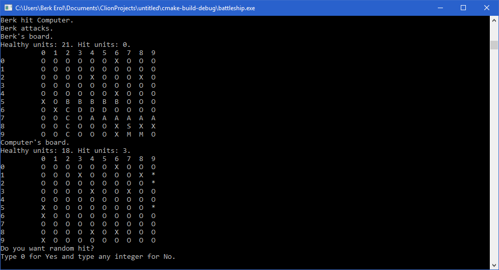

# Battleship

Remake of the classic game with customization options for adding variety.
You can set these options using _BattleshipConfiguration.ini_ file after building
(Hard-coding options into code is not necessary).

## Customizations & Features

* Choose which player plays first.
* Choose whether to continue to attack or not when the opponent is hit.
* __Play against computer (decides randomly) or against another player (hot seat).__
* __Specify the number of rows and columns of the board.__
* __Specify the number of each 6 ship type.__
* Randomly place your ships and attack opponent's ships.
* Viewing information about overall healthy and hit units.
* Viewing bars with row and column numbers for easier moves.
* Controlling the empty space of the board for ship placement.
* Controlling the area (whether it is occupied or hit before).

## Board Representation & Ship Types

* Hit areas
  * Empty: _X_
  * Non-empty: \*
* Non-hit areas
  * Empty: _O_
  * Aircraft carrier (5 units long): _A_
  * Cruiser (4 units long): _C_
  * Destroyer (3 units long): _D_
  * Frigate (2 units long): _F_
  * Boat (1 unit long): _B_

## Installation

_CMakeLists.txt_ is provided.

## Contribution

Feel free to contribute.

## Distribution

You can distribute this software freely under GNU GPL v3.0.